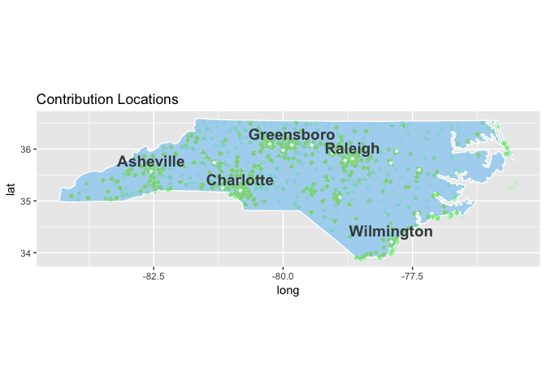
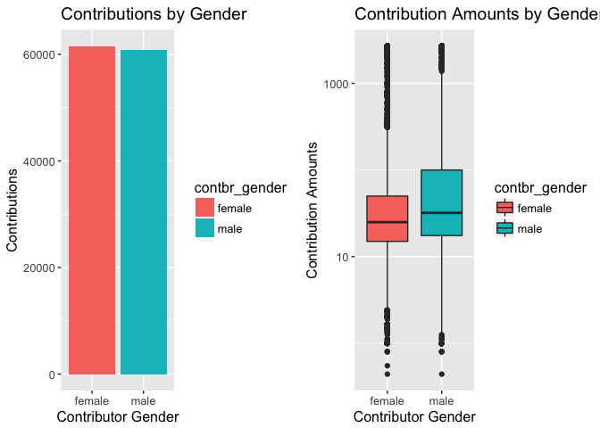

# North Carolina Financial Contributions to 2016 Presidential Campaigns
Andrew Ehsaei  
November 27, 2016  


## Abstract

In this report I will explore North Carolina's presidential campaign contributions within the 2016 election year. The goals of this report will be to understand the demographics and locations of contributors and look for interesting relationships in the data. 

## Introduction

In 1975, Congress created the Federal Election Commission (FEC) to administer and enforce the Federal Election Campaign Act (FECA) - the statute that governs the financing of federal elections. The duties of the FEC, which is an independent regulatory agency, are to disclose campaign finance information, to enforce the provisions of the law such as the limits and prohibitions on contributions, and to oversee the public funding of Presidential elections. The FEC maintains a website with many different databases related to campaign finance.

The presidential campaign contribution data is located here: http://fec.gov/disclosurep/PDownload.do

The file format for this dataset is located here: ftp://ftp.fec.gov/FEC/Presidential_Map/2016/DATA_DICTIONARIES/CONTRIBUTOR_FORMAT.txt

I will explore the dataset and look for comminalities among the campaign contributors within the state of North Carolina. I would look at contribution amounts broken down by the locations within the state, as well as the particular candidates supported by each location. I will also explore the demographics of the campaign contributors for each presidential nominee. This election was a historical year in that it was the first time a female presidential candidate (Hilary Clinton) became a nominee of a major political party. I will explore the breakdown of Hilary Clinton contributions by gender to see if there are any interesting correlations.

## Summary of the Dataset

I imported the dataset 'P00000001-NC.csv' into a data frame named <b>'cc'</b> which stands for <b>c</b>ampaign <b>c</b>ontributions.

```r
cc <- read.csv('/Users/aehsaei/Documents/Udacity/Project_4/P00000001-NC.csv', row.names=NULL)
```

Here is the basic structure of the 'cc' dataset:

```
## 'data.frame':	134457 obs. of  18 variables:
##   $ cmte_id          : Factor w/ 23 levels "C00458844","C00500587",..: 4 ..
##   $ cand_id          : Factor w/ 23 levels "P00003392","P20002671",..: 10..
##   $ cand_nm          : Factor w/ 23 levels "Bush, Jeb","Carson, Benjamin"..
##   $ contbr_nm        : Factor w/ 28991 levels "'CALLAHAN, CAROL",..: 1295..
##   $ contbr_city      : Factor w/ 849 levels "","`HENDERSONVILLE",..: 743 ..
##   $ contbr_st        : Factor w/ 1 level "NC": 1 1 ...
##   $ contbr_zip       : int  278868697 278868697 ...
##   $ contbr_employer  : Factor w/ 8675 levels "","#1 PROPERTIES OF LAKE N"..
##   $ contbr_occupation: Factor w/ 5100 levels ""," EDUCATOR",..: 2202 2202..
##   $ contb_receipt_amt: num  25 50 ...
##   $ contb_receipt_dt : Factor w/ 605 levels "01-APR-15","01-APR-16",..: 2..
##   $ receipt_desc     : Factor w/ 21 levels "","* EARMARKED CONTRIBUTION:"..
##   $ memo_cd          : Factor w/ 2 levels "","X": 1 1 ...
##   $ memo_text        : Factor w/ 73 levels "","* EARMARKED CONTRIBUTION:"..
##   $ form_tp          : Factor w/ 3 levels "SA17A","SA18",..: 1 1 ...
##   $ file_num         : int  1077664 1077664 ...
##   $ tran_id          : Factor w/ 134124 levels "A019041C2F7484C59839",..:..
##   $ election_tp      : Factor w/ 4 levels "","G2016","P2016",..: 3 3 ...
```
The dataset contains 19 variables and over 130,000 observations.

| Variable          | Definition                                |
|:----------------- |:----------------------------------------- |
| cmte_id           | committee id                              |
| cand_id           | candidate id                              |
| cand_nm           | candidate name                            |
| contbr_nm         | contributor name                          |
| contbr_city       | contributor city                          |
| contbr_st         | contributor state                         |
| contbr_zip        | contributor zip code                      |
| contbr_employer   | contributor employer                      |
| contbr_occupation | contributor occupation                    |
| contb_receipt_amt | contribution receipt amount               |
| contb_receipt_dt  | contribution receipt date                 |
| receipt_desc      | receipt description                       |
| memo_cd           | memo code                                 |
| memo_text         | memo text                                 |
| form_tp           | form type                                 |
| file_num          | file number                               |
| tran_id           | transaction id                            |
| election_tp       | election type / primary general indicator |

## Tidy Data

Let's take a closer look at some of the data frame variables and clean the data where needed. I expect there to be typos and spelling errors in the data. I also expect there to be missing data fields, which can be excluded from analysis.

<br />

##### contbr_zip: contributor zip code
First let's look at the zip codes to make sure they all reside within North Carolina. The first three digits of North Carolina zip codes range from 270 to 289. Let's see a summary of the zip code data.


```
##      Min.   1st Qu.    Median      Mean   3rd Qu.      Max.      NA's 
##         0 274552920 277054827 247517582 283481826 289069788         2
```

We can see there are some zip codes with '0' and 'NA' values so I'll remove these from the dataset. The zip code variable is a numerical type at the moment, but it makes more sense for this variable to be a factor type since each zip code represents a region of the state. I also noticed that the zip codes contain both standard formats (5 digit and 9 digit). Let's standardize the zip codes to the 5 digit format as well.


```r
# Remove any digits after the 5th digit
cc$contbr_zip <- substr(cc$contbr_zip, 1, 5)

# Subset the data using the expected zip code range
cc <- subset(cc, cc$contbr_zip > 27000 & 
                 cc$contbr_zip < 29000 &
                 !is.na(cc$contbr_zip))

# Convert the zip code to a factor variable
cc$contbr_zip <- as.factor(cc$contbr_zip)

# Print summary of the tidy zip code column
summary(cc$contbr_zip, maxsum = 9)
```

```
##   27516   27705   27517   27514   27707   28803   28804   27615 (Other) 
##    3084    2455    2397    1860    1762    1614    1605    1566  118034
```

<br />

##### contbr_occupation: contributor occupation
Next let's clean up elements in the dataset with unusable occupation data. First, let's look at the top 20 contributors' occupations. 


```r
# Group the occupations and show the top 20 most common
cc %>%
  group_by(contbr_occupation) %>%
  summarise(n = n()) %>%
  arrange(desc(n)) %>%
  head(20)
```

```
## # A tibble: 20 × 2
##                         contbr_occupation     n
##                                    <fctr> <int>
## 1                                 RETIRED 33527
## 2                            NOT EMPLOYED 12534
## 3                   INFORMATION REQUESTED  3695
## 4                               PHYSICIAN  2401
## 5                                ATTORNEY  2184
## 6                               HOMEMAKER  2033
## 7                               PROFESSOR  1987
## 8                                 TEACHER  1598
## 9                              CONSULTANT  1525
## 10                               ENGINEER  1521
## 11                                  SALES  1342
## 12 INFORMATION REQUESTED PER BEST EFFORTS  1051
## 13                                          986
## 14                                STUDENT   941
## 15                          SELF EMPLOYED   855
## 16                                     RN   766
## 17                                  OWNER   758
## 18                                MANAGER   752
## 19                      SOFTWARE ENGINEER   656
## 20                                 WRITER   603
```

We can see some occupations that we can exclude from analysis such as "INFORMATION REQUESTED," "INFORMATION REQUESTED PER BEST EFFORTS," and an empty field. Let's filter these and look at the top 20 again.


```r
# Subset the data by removing occupations with missing information
cc <- subset(cc, cc$contbr_occupation != "INFORMATION REQUESTED" &
                 cc$contbr_occupation != "INFORMATION REQUESTED PER BEST EFFORTS" &
                 cc$contbr_occupation != "" &
                 !is.na(cc$contbr_occupation))

# Change 'Registered Nurse' -> 'RN' to remove duplicates under a different name
cc$contbr_occupation <- gsub("REGISTERED NURSE", "RN", cc$contbr_occupation)

# Group the occupations again and show the top 20 most common
top_contributing_occupations <- cc %>%
  group_by(contbr_occupation) %>%
  summarise(n = n()) %>%
  arrange(desc(n))

# Show the top 20
head(top_contributing_occupations, 20)
```

```
## # A tibble: 20 × 2
##     contbr_occupation     n
##                 <chr> <int>
## 1             RETIRED 33527
## 2        NOT EMPLOYED 12534
## 3           PHYSICIAN  2401
## 4            ATTORNEY  2184
## 5           HOMEMAKER  2033
## 6           PROFESSOR  1987
## 7             TEACHER  1598
## 8          CONSULTANT  1525
## 9            ENGINEER  1521
## 10              SALES  1342
## 11                 RN  1290
## 12            STUDENT   941
## 13      SELF EMPLOYED   855
## 14              OWNER   758
## 15            MANAGER   752
## 16  SOFTWARE ENGINEER   656
## 17             WRITER   603
## 18             ARTIST   586
## 19           EDUCATOR   552
## 20 SOFTWARE DEVELOPER   525
```

<br />

#### contb_receipt_amt: contribution receipt amount
Let's next check that the contribution data falls within the expected range allowed for the 2016 election. According to the FEC, an individual may give a maximum of $2,700 per election to a Federal candidate or the candidate's campaign committee. The primary and general elections count as separately, therefore individuals may contribute $5,400 per candidate per cycle and couples may contribute $10,800. I should expect to see a range of values that makes sense in these bounds. Let's first look at the summary of the receipt amounts. 


```
##    Min. 1st Qu.  Median    Mean 3rd Qu.    Max. 
## -5400.0    15.0    27.0   101.3    75.0 10800.0
```

Looking at the summary data from the contribution amounts, we can see a minimum value that doesn't make sense. The minimum value in this column is a negative number (-5,400). Looking at the corresponding memo text we can see there are refunds listed in the dataset. I will remove all refund contributions from this dataset.


```r
# Subset the data by removing contributions less than 0
cc <- subset(cc, contb_receipt_amt > 0)
summary(cc$contb_receipt_amt)
```

```
##     Min.  1st Qu.   Median     Mean  3rd Qu.     Max. 
##     0.38    15.00    27.00   103.62    75.00 10800.00
```

## Add Variables

There are a few variables that are not currently present in the dataset that I would like to add to the 'cc' data frame. I would like to add candidate gender, contributor gender, candidate political party affiliation, and contributor latitude/logitude coordinates (for map-plotting).

<br />

#### Gender
There is an 'R' package available from CRAN named 'gender' which can be used to predict gender using first names and dates of birth using historical datasets. The 'cc' dataframe currently has a single field for contributor name and a single field for candidate name. I will break out the first and last names of each into separate variables named 'cand_first_nm,' 'cand_last_nm,' contbr_first_nm,' and 'contbr_last_nm.'


```r
# Candidate First/Last Name
cc <- separate(cc, cand_nm, sep = ",", into = c("cand_last_nm", "cand_first_nm"), remove = FALSE)

# Remove any middle name or prefix/suffix and trim whitespace
cc$cand_first_nm <- trimws(cc$cand_first_nm, which = c("both"))
cc$cand_first_nm <- sub(" .*", "", cc$cand_first_nm)

# Contributor First/Last Name
cc <- separate(cc, contbr_nm, sep = ",", into = c("contbr_last_nm", "contbr_first_nm"), remove = FALSE, extra = "drop")

# Remove any middle name or prefix/suffix and trim whitespace
cc$contbr_first_nm <- trimws(cc$contbr_first_nm, which = c("both"))
cc$contbr_first_nm <- sub(" .*", "", cc$contbr_first_nm)

# Replace candidate "Raphael Cruz" first name with his commonly known first name "Ted"
cc$cand_first_nm <- sub("Rafael", "Ted", cc$cand_first_nm)
```

Now that we have the names separated into first and last names, we can pass in these values to the built in method within the 'gender' package to predict gender based on the name.


```r
# Create a candidate gender data frame
cand_gender_df <- gender_df(data = data_frame(names = cc$cand_first_nm, min_year = 1940, max_year = 1970), 
                            year_col = c("min_year", "max_year"), 
                            name_col = "names")

# Reduce the candidate gender data frame to only name and gender
cand_gender_df <- data.frame("cand_name" = cand_gender_df$name, "cand_gender" = cand_gender_df$gender)

# Merge the candidate gender data frame and the main data frame
cc <- merge(cc, cand_gender_df, by.x = "cand_first_nm", by.y = "cand_name")
```

Let's repeat the same process for the contributors.


```r
# Create a contributor gender data frame
contbr_gender_df <- gender_df(data = data_frame(names = cc$contbr_first_nm, min_year = 1940, max_year = 1970), 
                            year_col = c("min_year", "max_year"), 
                            name_col = "names")

# Reduce the contributor gender data frame to only name and gender
contbr_gender_df <- data.frame("contbr_name" = contbr_gender_df$name, "contbr_gender" = contbr_gender_df$gender)

# Merge the contributor gender data frame and the main data frame
cc <- merge(cc, contbr_gender_df, by.x = "contbr_first_nm", by.y = "contbr_name")
```

<br />

#### Party Affiliation
Next, I will create a variable to assign the political party affiliation to each candidate. I created the political party data frame manually and then merged it wil the main 'cc' data frame.


```r
# Create a new data frame to be used as a key
cand_df <- data.frame("cand_last_nm" = cc$cand_last_nm) %>%
  group_by(cand_last_nm) %>%
  unique()

# Assign the political party based on looking up each candidate on the web
cand_df$cand_party <- ifelse(cand_df$cand_last_nm == "Clinton" |
                             cand_df$cand_last_nm == "Sanders" |
                             cand_df$cand_last_nm == "O'Malley" |
                             cand_df$cand_last_nm == "Lessig" |
                             cand_df$cand_last_nm == "Webb", 
                             c("democrat"), 
                             c("republican"))

cand_df$cand_party[cand_df$cand_last_nm == "Stein"] <- "green"
cand_df$cand_party[cand_df$cand_last_nm == "Johnson"] <- "libertarian"
cand_df$cand_party[cand_df$cand_last_nm == "McMullin"] <- "independent"

# Merge the party data frame and the main data frame
cc <- merge(cc, cand_df, by.x = "cand_last_nm", by.y = "cand_last_nm")
```

<br />

#### Latitude Longitude Coordinates
Lastly, I will add latitude and logitude coordinates using the 'cc' zip codes. I'll use the latitude and logitude coordinates to plot areas on a map in my analysis. To calculate the latitude and logitude based on the zip code, I will use the CRAN package named 'zipcode.' This package contains a database of city, state, latitude, and longitude information for U.S. ZIP codes from the CivicSpace Database (August 2004).


```r
data(zipcode)
cc <- merge(cc, zipcode, by.x = "contbr_zip", by.y = "zip")
```

<br />

After data cleansing and additional variables, the 'cc' data frame has the following structure:

```
## 'data.frame':	122422 obs. of  27 variables:
##   $ cmte_id          : Factor w/ 23 levels "C00458844","C00500587",..: 14..
##   $ cand_id          : Factor w/ 23 levels "P00003392","P20002671",..: 22..
##   $ cand_nm          : Factor w/ 23 levels "Bush, Jeb","Carson, Benjamin"..
##   $ cand_first_nm    : Factor w/ 22 levels "Benjamin","Bernard",..: 6 6 ...
##   $ cand_last_nm     : Factor w/ 23 levels "Bush","Carson",..: 21 21 ...
##   $ cand_gender      : Factor w/ 2 levels "female","male": 2 2 ...
##   $ cand_party       : Factor w/ 5 levels "democrat","green",..: 5 5 ...
##   $ contbr_nm        : Factor w/ 28991 levels "'CALLAHAN, CAROL",..: 2755..
##   $ contbr_first_nm  : Factor w/ 2736 levels "AARON","ABBIE",..: 1262 143..
##   $ contbr_last_nm   : Factor w/ 11297 levels "'CALLAHAN","AAKERT",..: 10..
##   $ contbr_gender    : Factor w/ 2 levels "female","male": 2 2 ...
##   $ contbr_occupation: chr  "RETIRED" ...
##   $ contbr_employer  : Factor w/ 8675 levels "","#1 PROPERTIES OF LAKE N"..
##   $ contb_receipt_amt: num  240 80 ...
##   $ contb_receipt_dt : Factor w/ 605 levels "01-APR-15","01-APR-16",..: 4..
##   $ contbr_city      : Factor w/ 849 levels "","`HENDERSONVILLE",..: 65 6..
##   $ contbr_st        : Factor w/ 1 level "NC": 1 1 ...
##   $ contbr_zip       : Factor w/ 878 levels "27006","27007",..: 1 1 ...
##   $ latitude         : num  36 ...
##   $ longitude        : num  -80.4 ...
##   $ receipt_desc     : Factor w/ 21 levels "","* EARMARKED CONTRIBUTION:"..
##   $ election_tp      : Factor w/ 4 levels "","G2016","P2016",..: 2 3 ...
##   $ memo_cd          : Factor w/ 2 levels "","X": 2 2 ...
##   $ memo_text        : Factor w/ 73 levels "","* EARMARKED CONTRIBUTION:"..
##   $ form_tp          : Factor w/ 3 levels "SA17A","SA18",..: 2 2 ...
##   $ file_num         : int  1119574 1104813 ...
##   $ tran_id          : Factor w/ 134124 levels "A019041C2F7484C59839",..:..
```
The dataset contains 27 variables and over 120,000 observations.

| Variable          | Definition                                |
|:----------------- |:----------------------------------------- |
| cmte_id           | committee id                              |
| cand_id           | candidate id                              |
| cand_nm           | candidate name                            |
| cand_first_nm     | candidate first name                      |
| cand_last_nm      | candidate last name                       |
| cand_gender       | gender of candidate                       |
| cand_party        | political party affiliation of candidate  |
| contbr_nm         | contributor name                          |
| contbr_first_nm   | contributor first name                    |
| contbr_last_nm    | contributor last name                     |
| contbr_gender     | gender of contributor                     |
| contbr_occupation | contributor occupation                    |
| contbr_employer   | contributor employer                      |
| contb_receipt_amt | contribution receipt amount               |
| contb_receipt_dt  | contribution receipt date                 |
| contbr_city       | contributor city                          |
| contbr_st         | contributor state                         |
| contbr_zip        | contributor zip code                      |
| latitude          | latitude coordinate of contributor        |
| longitude         | longitude coordinate of contributor       |
| receipt_desc      | receipt description                       |
| election_tp       | election type / primary general indicator |
| memo_cd           | memo code                                 |
| memo_text         | memo text                                 |
| form_tp           | form type                                 |
| file_num          | file number                               |
| tran_id           | transaction id                            |

## Analysis
Now that we have clean dataset, we can start exploring some of the data. Let's first take a look at the candidates. Let's see how many different candidates received campaign contributions from North Carolinians in 2016.


```r
# Group candidates by name and total contributions
candidates <- cc %>%
  group_by(cand_nm) %>%
  summarise(n = n()) %>%
  arrange(desc(n))

# Print summary of grouped candidates
summary(candidates)
```

```
##                       cand_nm         n          
##  Bush, Jeb                : 1   Min.   :    5.0  
##  Carson, Benjamin S.      : 1   1st Qu.:   39.5  
##  Christie, Christopher J. : 1   Median :  219.0  
##  Clinton, Hillary Rodham  : 1   Mean   : 5322.7  
##  Cruz, Rafael Edward 'Ted': 1   3rd Qu.: 1346.5  
##  Fiorina, Carly           : 1   Max.   :50110.0  
##  (Other)                  :17
```

```r
# Print the number of unique candidates
length(candidates$cand_nm)
```

```
## [1] 23
```

There were 23 presidential candidates that received contributions from North Carolina in 2016. The smallest amount of contributions to a candidate was 5 and the largest amount of contributions was just over 50 thousand. The mean number of contributions to a candidate is around 5 thousand.

### Who are the 2016 presidential candidates?
Let's plot the candidates and number of contributions using a barplot and color the bars based on political party.

<!-- -->

There are a handful of candidates that clearly received the majority of the contributions. I'll replot the data and only focus in on candidates that received over a thousand contributions. This will allow us to focus on the candidates that received most of the contributions.

<!-- -->

Here we can see that Clinton and Sanders received the most contributions by far. Both of these candidates received more than twice the number of contributions as the next candidate in this plot. It also looks like the democratic candidates received many more contributions than the republican candidates. 

### Which party received the most contributions?
Let's take a look at the total number of contributions to the democratic and republic parties.

<!-- -->

We can see the democratic candidates received over twice as many contributions as the republican candidates. This is not the total amount of money contributed to the party candidates, only the total amount of contributions.

### Which party received the most money?
The amount of money in each contribution can vary up to $2,700 (upper limit for individual contributors), so the party that received the most amount of contributions does not neccessarily mean that it received the most money in total. Let's calculate the total amount of money contributed to each of the party candidates.


```r
# Calculate the total contribution amounts for each party
partycontribution_amt <- aggregate(cc$contb_receipt_amt, by = list(cc$cand_party), FUN = sum) %>%
  arrange(desc(x))

# Rename the column headers
partycontribution_amt <- rename(partycontribution_amt, c("Group.1" = "party", "x" = "dollars"))
partycontribution_amt
```

```
##         party    dollars
## 1    democrat 6935521.76
## 2  republican 5634842.19
## 3 libertarian   72093.25
## 4       green   15415.75
## 5 independent    5972.00
```

So we can see that democrats did in fact receive the most contribution dollars, but not by the margin that the previous contribution plot indicated. The republican contributors must have contributed higher amounts than the democrats in order to close the gap between the number of contributions and contribution amounts. 

### Which party received the highest average contribution?
Let's calculate the average contribution amount for each of the parties and see if the republican contributors did in fact contribute higher amounts over democrats on average.


```r
cc %>%
  group_by(cand_party) %>%
  summarise(mean_contribution = mean(contb_receipt_amt)) %>%
  arrange(desc(mean_contribution))
```

```
## # A tibble: 5 × 2
##    cand_party mean_contribution
##        <fctr>             <dbl>
## 1 libertarian         249.45761
## 2  republican         168.13900
## 3 independent         129.82609
## 4       green         115.04291
## 5    democrat          78.42064
```

The results here are a little surprising. The highest average contribution was to libertarian candidates. The part that was not surprising was that republican contributors on average donated about twice as much as the democrat contributors. The republican contributors must have donated more on average for the previous plots to make sense, since we saw that there were a lot more contributions to democratic candidates but the total dollar amount was not much larger. Next, let's take a closer look at the contribution amounts.

<!-- -->

We can see the majority of the contributions were well under the contribution limit of $2,700 (for individuals). There are some amounts of contributions at the $500, $1000 marks, but most of the contributions are under the $500 mark. Let's look at a plot of the contributions to each party to see if we can notice a difference in the frequencies of contirbution amounts.

<!-- -->

I plotted the party contributions using a log10 scale to focus on the location of the peak of each plot and see the shape of the plots relative to each other. We can see that only the democrat and republican parties show significant sized bars on this chart. The other parties did not receive nearly as many contributions. There are very tiny bars centered around the 100 mark, but the major players in this comparison are the republican and democrat parties. Between these two, it is clear that the democrat party received a larger number of contributions at a lower amount, and the republican contribution amounts peak at a higher value. Both plots are normally-shaped after performing the log10 scale transformation along the x axis. 

### How many unique contributors were there in 2016?
Let's look at the number of unique contributors in this dataset. We can do this by using the 'unique' method and passing in a list of qualifiers for a unique entry such as contributor name, city, zip code, employer, and occupation. Then we can calculate the length of this new reduced data frame to see the number of unique contributors. One thing of note, there isn't an ID field associated with the contributor. It is possible that multiple people with the exact same attributes exist, but this occurrence should be rare and I'm noting the risk. It would be nice if the dataset had a unique ID attribute for each contributor.


```r
length(unique(cc[c("contbr_nm", "contbr_zip", "contbr_employer", "contbr_occupation")])$contbr_nm)
```

```
## [1] 27613
```
There are around 27 thousand unique contributors in this dataset. That means many people must have donated multiple times in order to reach the roughly 120 thousand contributions that was calculated earlier.

### Where are the contributors located? 
Let's take a look at the locations where the contributions were located. I'll plot the latitude and logitude coordinates on a state map to show the locations of each contribution. I used "map_data" and "us.cities" databases to create the underlying state and city locations.


```r
# Get the map data for North Carolina
nc <- map_data("state", region = "north carolina")

# Get the North Carolina city location data from the us.cities database
nc_cities <- subset(us.cities, country.etc == "NC")

# Do a string replace to remove "NC" from city names
nc_cities$name <- gsub(" NC", "", nc_cities$name)

# Plot the map of the state and overlay city locations, city names, contribution locations
ggplot() +
  geom_polygon(data = nc, aes(x = long, y = lat, group = group), colour = "white", fill = "#AED6F1") +
  geom_point(data = cc, aes(x = longitude, y = latitude), alpha = 1/110, colour = "#ABEBC6", shape = 16, size = 2) +
  geom_point(data = nc_cities, aes(x = long, y = lat), color = "white", shape = 18) +
  geom_text(data = subset(nc_cities, 
                          name == "Asheville"  | 
                          name == "Charlotte"  | 
                          name == "Raleigh"    | 
                          name == "Greensboro" |
                          name == "Wilmington"), 
            hjust = 0.5, vjust = -0.5, aes(x = long, y = lat, label = name), colour = "#424949", size = 5, fontface = "bold") +
  coord_fixed() +
  ggtitle("Contribution Locations")
```

<!-- -->

Looking at the plot, we can see the clusters of contributions around the most populated cities. One thing that surprised me was that there were more rural contributions than I expected. Let's look at the same plot again, but color the contribution locations with the party affiliation. 


```r
# Plot the map of the state and overlay city locations, city names, contribution locations but have separate plots for each party subset
p1 <- ggplot() +
  geom_polygon(data = nc, aes(x = long, y = lat, group = group), colour = "black", fill = "white") +
  geom_point(data = subset(cc, cand_party == "democrat"   ), aes(x = longitude, y = latitude), alpha = 1/110, colour = "#3498DB", shape = 16, size = 5) +
  geom_point(data = nc_cities, aes(x = long, y = lat), color = "white", shape = 18) +
  geom_text(data = subset(nc_cities, 
                          name == "Asheville"  | 
                          name == "Charlotte"  | 
                          name == "Raleigh"    | 
                          name == "Greensboro" |
                          name == "Wilmington"), 
            hjust = 0.5, vjust = -0.5, aes(x = long, y = lat, label = name), colour = "black", size = 5, fontface = "bold") +
  coord_fixed() +
  ggtitle("Democrat Contributions")

p2 <- ggplot() +
  geom_polygon(data = nc, aes(x = long, y = lat, group = group), colour = "black", fill = "white") +
  geom_point(data = subset(cc, cand_party == "republican"   ), aes(x = longitude, y = latitude), alpha = 1/110, colour = "#E74C3C", shape = 16, size = 5) +
  geom_point(data = nc_cities, aes(x = long, y = lat), color = "white", shape = 18) +
  geom_text(data = subset(nc_cities, 
                          name == "Asheville"  | 
                          name == "Charlotte"  | 
                          name == "Raleigh"    | 
                          name == "Greensboro" |
                          name == "Wilmington"), 
            hjust = 0.5, vjust = -0.5, aes(x = long, y = lat, label = name), colour = "black", size = 5, fontface = "bold") +
  coord_fixed() +
  ggtitle("Republican Contributions")

grid.arrange(p1, p2, ncol = 1)
```

<!-- -->

These two plots don't show much difference between republican and democrat contributor locations. The democrat contributions do seem to be slightly more concentrated in Asheville as one discernible difference.

### What are the contributor occupations?
Let's take a look at the occupations next. Let's see how many unique occupations contributed to the presidential campaigns. I'll follow the same process as with the unique contributors.


```r
length(unique(cc[c("contbr_occupation")])$contbr_occupation)
```

```
## [1] 4923
```

It looks like there are just under 5 thousand occupations reported in this dataset. That's a lot of occupations and I'll need to subset this data when plotting to focus on the more common professions. Let's look at the top 10 occupations that contributed to presidential candidates.

<!-- -->

We can see the top occupation that contributed to candidates was retired people. It is surprising to me that the top two listed here are "retired" and "unemployed" citizens. I would think the top contributors would be working and in highly-paid professions. Let's now break this down and show top contributors for each party to see if there is a difference than the aggregate.

<!-- -->

We can see that retired people made the most contributions by far to both democrat and republican candidates. There is also another very large population of unemployed contributors to democratic candidates. Let's remove these non-occupations from both plots and re-plot to see the differences in other occupations more clearly.

<!-- -->

These plots show the top 10 contributors to the democratic and republican candidates, with retired and unemployed contributors removed from the plots. We can see a big difference between the amount of contributions between the two plots. It is interesting that physicians, professors, and attorneys are the top contributors for democratic candidates, whereas homemakers and sales associates top the chart on the republican plot.

## Final Plots and Summary
The final question I would like to explore is how did gender factor into North Carolina campaign contributions in 2016. 

In 1872, Victoria Woodhull became the first female presidential candidate. Her candidacy preceded suffrage for women in the U.S. In 2016, Hillary Clinton became the first female presidential candidate nominated by a major party, namely the Democrats. This was a historical year and I am curious as to how the gender of a major candidate was supported by the genders of donors. First, let's look at the contribution and contribution amounts broken down by gender.

<!-- -->

The total number of male and female contributors look almost equal, but male contributors donated in slightly larger amounts. Let's see what the average contribution amount was for each gender.


```
## # A tibble: 2 × 2
##   contbr_gender average_contribution
##          <fctr>                <dbl>
## 1        female             87.35151
## 2          male            119.71878
```

This result shows that females contributed $87 on average, whereas males contributed $119 on average in 2016. Let's next look to see if there were a disproportionate amount of contributions to each candidate gender.

<!-- -->

There is a big difference here. Female contributors donated to female candidates slightly more often than male candidates, however male contributors donated primarily to male candidates. There were only 3 prominent female candidates out of 23 total candidates. There does seem to be a disproportionate amount of contributions to the female candidates and I think this is due to the female democratic front-running candidate Hillary Clinton. Let's see if female contributors donated to Hillary Clinton more often than male contributors.

<!-- -->

This shows that in fact Hillary Clinton received the largest amount of female contributions among the candidates in 2016. Of the top six candidates here, she is the only on to have a majority of contributions by female contributors. Let's look at the Hillary Clinton supporters' occupations broken down by gender next.

<!-- -->

Hillary Clinton supporters of the top contributing occupations were mostly female. There was a large amount of retired Clinton supporters that was nearly double the retired male supporters. Let's take a look at one last plot to show contribution amounts broken down by gender.

<!-- -->

This plot shows the contribution amounts broken down by gender for each of the top candidates. We can see the democrat candidates Clinton and Sanders received lower contribution amounts relative to the other republican contribution amounts. We can also see the breakdown of male and female contributors here. Female contributors gave slightly more for Clinton and Trump, and significantly more for Cruz and Rubio.

------

## Reflection

The 2016 presidential election year was a historic year. Hillary Clinton became the first major party presidential nominee. In this analysis, we looked at a lot within the 2016 presidential contributions dataset for North Carolina and I focused in on some relationships around gender and political party affiliation. 

Politically speaking, North Carolina has been said to be a "purple state" referring to the combination of colors (red and blue) which represent the democrat and republican parties. After looking at some of the data from the 2016 campaign contributions I will agree. There were many differences in the data corresponding to each political party, but the total money contributed to each party was very similar. The democrat candidates received more, but smaller dollar amount contributions than the republicans. The republican candidates received fewer, but larger dollar amount contributions. Looking at the contributor locations on the map of the state we saw that there wasn't a big difference in any area of the state. Both plots looked similar and both party candidates received contributions from cities as well as rural areas. One relationship that was seen was the female contributors support for Hillary Clinton in 2016. Clinton received a majority of female contributors over the other candidates across both parties.

This analysis only looked at a brief window of time leading up to the 2016 presidential election. The relationships and figures could differ greatly if the entire campaign data was also analyzed. I spent a good amount of time cleaning several issues with the data, but I'm sure there are other bugs and overlooked issues. I also used a package to predict the gender of each contributor using a predicted birthday range. This method does not yield a definitive result and I acknowledge the possibility that the gender results are skewed accordingly.

I am happy with the results and think there is some valuable data present here. The presidential campaigns could look for relationships to target certain demographics in the next campaign in order to raise more money next time. It would also be very interesting to look at voting data compared to the campaign contribution data to see how the two are related. It is presently passed election day and the front-running candidate that received the most funds in North Carolina in 2016 did not win the election. It would be interesting to compare contributions with voting results in the future. 
  
## Resources

* histogram plotting:   http://docs.ggplot2.org/0.9.3.1/geom_histogram.html
* ggmap mapping:        https://github.com/dkahle/ggmap
* map visualizations:   https://uchicagoconsulting.wordpress.com/tag/r-ggplot2-maps-visualization
* html colors:          http://htmlcolorcodes.com
